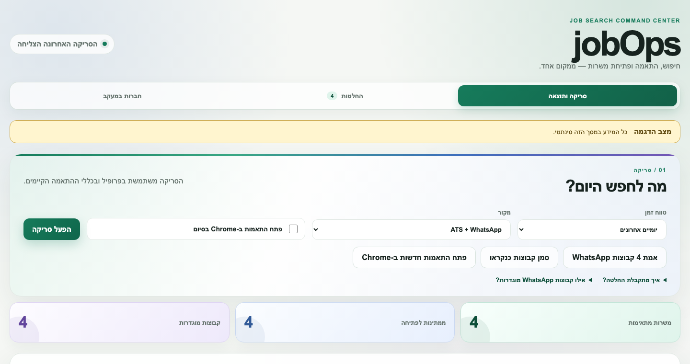
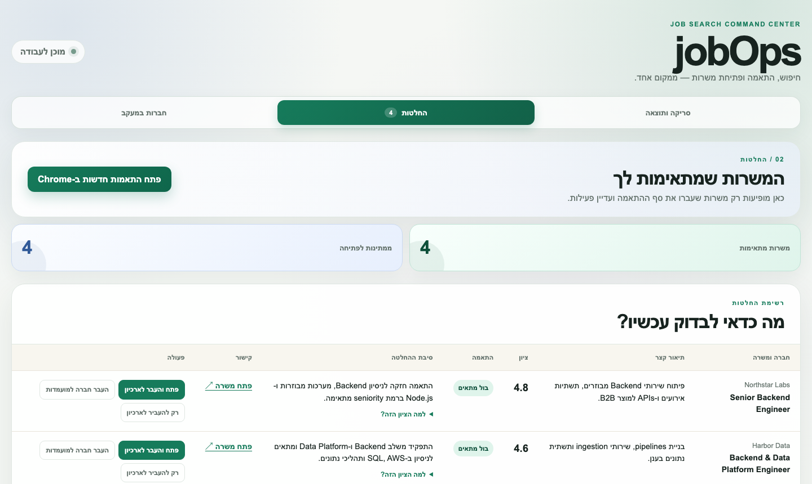

# jobOps

[](https://github.com/amirge118/jobops/actions/workflows/ci.yml)
[](https://nodejs.org/)
[](LICENSE)

**A local-first command center for the job search itself.**

Company career pages and private WhatsApp groups both surface real roles — and both are
tedious to track by hand. jobOps scans both in one pass, verifies each posting is actually
live, scores it against your own profile with a plain-language reason, and drops the noise —
so you only ever look at roles worth your time.

Nothing leaves your machine except the job page itself, sent to your own signed-in ChatGPT
session for scoring. No API keys, no cloud database, no third-party server in the loop.



## What it does

- 🔎 **Scans everywhere roles actually appear** — ATS boards (Greenhouse, Lever, Ashby,
  Workable, Comeet, Workday, and more) *and* your configured WhatsApp groups, in one run.
- 🧠 **Explains every decision** — a Codex-scored fit label with the one reason behind it, not
  a black-box ranking. `בול מתאים`, `מתאים`, or `לא מתאים` — never a mystery.
- ✅ **Verifies before it scores** — a dead or reposted listing never gets treated as a fresh
  match; liveness is checked, not assumed.
- 🔁 **Deduplicates across sources** — the same role found on WhatsApp and a company's own
  board collapses into one entry, once.
- 🏢 **Grows its own watchlist** — a company surfaced from a good WhatsApp lead becomes a
  tracked source with one click, no manual config editing.
- 🖥️ **A real dashboard, not just a CLI** — scan, review matches, and manage tracked companies
  from a local web UI at `127.0.0.1:4177`.
- 🙅 **Never applies for you** — it opens the real application URL in Chrome; you always send it.



## Try it in 60 seconds

The demo runs on synthetic companies and jobs — no WhatsApp, no ChatGPT login, no real data.

```bash
git clone https://github.com/amirge118/jobops.git
cd jobops
npm ci
npm run demo
```

## Run it on your own search

```bash
npm ci
npx playwright install chromium
npm run setup         # build your candidate profile from a CV
codex login           # sign in with ChatGPT — no API key needed
npm run start:local   # WhatsApp collector + dashboard
```

Then open `http://127.0.0.1:4177` and configure your sources in `config/jobs.yml` and
`portals.yml`.

## Learn more

The [full technical reference](docs/TECHNICAL.md) covers every subsystem in depth: the scan
pipeline, the WhatsApp collector and its coverage guarantees, the dashboard's API surface,
diagnostics and retry behavior, and every engineering decision behind them. Architecture
decisions also live in [`docs/adr/`](docs/adr/).

## License

MIT — see [LICENSE](LICENSE). Adapted upstream components are credited in
[THIRD_PARTY_NOTICES.md](THIRD_PARTY_NOTICES.md).
