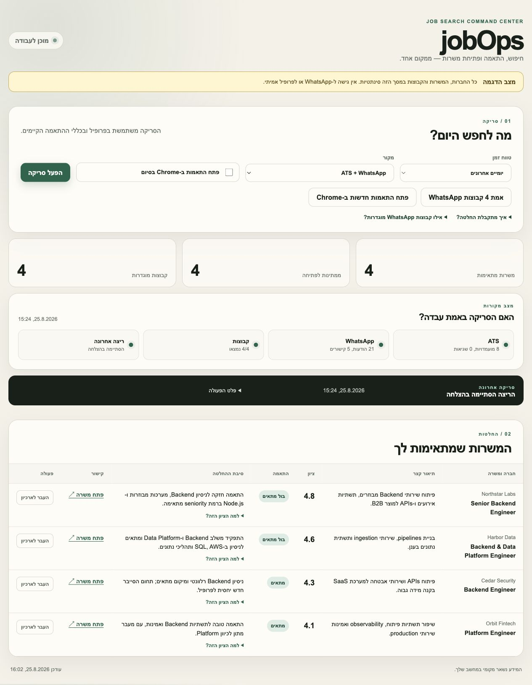
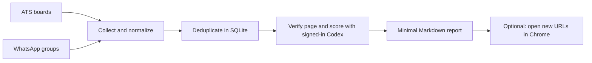

# jobOps

[](https://github.com/amirge118/jobops/actions/workflows/ci.yml)
[](https://nodejs.org/)
[](LICENSE)

Personal, local-first job search automation for the Israeli tech market. One command scans
company ATS boards and selected WhatsApp groups, verifies job pages, scores each role against
the candidate profile, removes repeats, and produces a short Hebrew report. A local web
dashboard exposes the same workflow without requiring terminal commands.



## Why jobOps

Most job-search tools begin and end with public job boards. In the Israeli tech market, useful
roles also arrive through private WhatsApp communities and are easy to lose, reread, or evaluate
inconsistently. jobOps treats the search as one local pipeline: collect, normalize, deduplicate,
verify, explain the fit, and keep only the matches worth reviewing.

The project is intentionally local-first. Personal profiles, WhatsApp credentials, scan history,
reports, and application state never need to enter source control or a hosted database.

## Try the demo

The fastest way to explore jobOps uses synthetic companies, jobs, groups, and scan results. It
does not connect to WhatsApp, read a candidate profile, invoke Codex, or modify real job data.

```bash
git clone https://github.com/amirge118/jobops.git
cd jobops
npm ci
npm run demo
```

The demo shows source health, four suitable jobs, transparent score breakdowns, dedup-aware
archiving, and the same dashboard used by the real workflow.

jobOps never submits an application. It can open matching application URLs in Chrome, but the
candidate reviews and submits them manually.

## What the unified scan does



The decision stays deliberately small: `מתאים` or `לא מתאים`, with `בול מתאים` as the
high-score label. A missing programming language or framework can lower the score, but is not
an automatic blocker. Only basic incompatibilities such as an inactive posting, wrong role
domain, incompatible location, or missing application URL block a match.

The report stays intentionally minimal and contains only:

- company
- short job description
- score
- match label
- one decision reason
- application URL

## Quick start

Requirements: Node.js 22+, npm, Google Chrome, and Codex CLI signed in with ChatGPT. No model
API key is required. Playwright's Chromium is used only when a regular HTTP check cannot
determine whether a posting is active.

```bash
npm ci
npx playwright install chromium
npm run setup
codex login
npm run doctor
```

`codex login status` must report `Logged in using ChatGPT`. Fill in the two private profile
files and configure sources in `config/jobs.yml`. On macOS, jobOps automatically finds the
Codex binary bundled with the ChatGPT desktop app; `CODEX_BIN` is available as an override.

```bash
npm run jobs -- --dry-run --ats-only  # safe ATS preview
npm run jobs -- --days 2              # scan the last two days
npm run jobs -- --days 2 --open       # also open new matches in Chrome
npm run jobs:open                      # open matches that were not opened yet
npm run jobs:verify-groups             # confirm configured WhatsApp groups still exist
npm run web                            # open the local dashboard in Chrome
```

The dashboard runs only on `127.0.0.1:4177`. It shows the jobs already evaluated in the shared
SQLite store and provides three bounded actions: scan, verify WhatsApp groups, and open new
matching URLs in Chrome. Only one action can run at a time, and the UI displays its live output.
It does not add a second database or duplicate the scanner's decision logic.

The source-health panel distinguishes "no new jobs" from a failed or incomplete collection run.
It reports ATS errors, WhatsApp message/link counts, configured groups found, and the last-run
result. Each matching job also has an optional score breakdown for CV fit, seniority, role scope,
location, sector, and remaining uncertainties. The Markdown report remains minimal.

Only suitable active jobs appear in the dashboard and reports. A rejected job keeps only its
canonical identity and cache hashes required to prevent duplicate work; its company, title,
description, score, decision reason, and source details are discarded.

On first WhatsApp use, the terminal shows a QR code. Pair it from WhatsApp under **Linked
devices**. The local `auth/` directory contains sensitive session credentials and must never be
committed or shared. WhatsApp access uses the unofficial Baileys client, so upstream WhatsApp
changes can occasionally require a dependency update or a new pairing.

WhatsApp read state is explicit. With `sources.whatsapp.markRead: true`, messages collected from
the four configured groups are marked as read after processing; no other chats are touched. The
scanner still sets `markOnlineOnConnect: false` and never sends a chat message. Run
`npm run jobs:mark-read` to mark only those configured group chats without running job scoring.

Keep `authPath` inside this project so Baileys can safely refresh its session files. When moving
from the standalone `whatsappJobsScanner`, copy its existing private `auth/` directory into this
project once and set `authPath: "auth"`; the original session can remain untouched. Import its
message-level dedup state once with `npm run jobs:migrate-whatsapp`. The import is idempotent and
never moves a newer checkpoint backwards. After migration, avoid running both scanners at the
same time so two copies of the same linked-device session do not update independently.

Each run reports ATS counts and, for every configured WhatsApp group, the number of messages and
job links collected. WhatsApp history retrieval is best-effort: if the service returns no history,
the run displays a clear warning instead of treating an empty result as proof that no messages
exist. New messages and dedup state continue to be tracked locally.

## Codex scoring without API billing

New active jobs are scored through `codex exec`, authenticated with the local ChatGPT login.
The child process is forced to the `chatgpt` login method, ignores API-oriented user config,
does not inherit `OPENAI_API_KEY`, and runs in a read-only ephemeral sandbox. Jobs are grouped
in batches of eight by default to reduce repeated context.

This avoids usage-based OpenAI or Anthropic API billing. It still consumes the included
Codex/ChatGPT usage allowance or workspace credits associated with the signed-in plan. See the
[official Codex authentication documentation](https://learn.chatgpt.com/docs/auth) and
[non-interactive mode documentation](https://learn.chatgpt.com/docs/non-interactive-mode).

## Repeat protection and scan windows

`data/jobs.db` is the source of truth for job URLs, normalized company/role identities, message
status, page cache, scan checkpoints, and whether a result was already shown or opened.
The dashboard also lets you archive a reviewed match. Archived jobs disappear from active lists,
retain only their dedup identity, and cannot surface again in later scans.

The unified ATS adapter deliberately ignores the older Markdown/TSV dedup files while collecting;
every candidate first reaches SQLite, which prevents a legacy pipeline entry from disappearing
before it can be evaluated for the dashboard. The older standalone scan commands keep their
original file-based dedup behavior.

- The first run looks back two days by default.
- Later runs start from the last successful run with a 12-hour overlap.
- `--days N` explicitly selects a window, capped by `maxLookbackDays`.
- Tracking parameters are removed before URL comparison.
- Failed WhatsApp messages remain retryable; successful messages are not processed again.
- A page is rescored only when its content, status, profile, or scoring criteria change.

These values are configurable in `config/jobs.yml`.

## Project structure

```text
config/jobs.example.yml  public configuration template
portals.yml              ATS companies and fast pre-filters
scripts/jobs.mjs         unified CLI
scripts/jobs/            shared collection, scoring, storage, and reporting modules
scripts/providers/       ATS provider adapters
scripts/web.mjs          local dashboard HTTP server and action runner
web/                     dependency-free Hebrew dashboard UI
tests/                   Node test suite
templates/               public profile and document templates
docs/assets/             public screenshots generated from demo data
.agents/skills/          reusable Codex job-search workflows

profile/                 private candidate profile (ignored)
auth/                    private WhatsApp session (ignored)
data/                    private SQLite state and application pipeline (ignored)
reports/                 generated reports (ignored)
documents/               private source CVs (ignored)
```

The older focused commands remain available for maintenance tasks:

```bash
npm run scan:dry
npm run liveness
npm run dedup
npm run normalize
npm run pdf -- input.html output.pdf --format=a4
```

## Development

```bash
npm run check
npm test
npm run scan:dry
```

## Engineering decisions

- **One source of truth:** SQLite owns URL identity, source checkpoints, page cache, decisions,
  presentation, opening, and archive state.
- **Explainable but quiet:** the primary decision remains `מתאים` or `לא מתאים`; detailed scoring
  is available on demand without adding report columns.
- **Privacy by construction:** rejected roles discard descriptive data and retain only the
  technical identity required for deduplication.
- **Bounded local actions:** the dashboard executes a fixed allowlist of commands without a shell
  and listens only on `127.0.0.1`.
- **No scoring API key:** matching runs through the locally signed-in Codex CLI and explicitly
  removes API-oriented credentials from the child process.
- **Runnable without secrets:** `npm run demo` makes the full product surface reviewable with
  isolated synthetic data.

CI runs syntax checks and the test suite on Node.js 22. See [CONTRIBUTING.md](CONTRIBUTING.md)
for contribution and privacy guidance.

## Privacy and publication

The repository is designed so the reusable application can be published while candidate data,
CVs, WhatsApp credentials, scan state, generated reports, and environment variables stay local.
Before publishing, review `git status --ignored` and run `gitleaks dir . --redact`.

During scoring, the candidate profile and fetched job text are sent to Codex under the data and
retention settings of the ChatGPT account or workspace used by `codex login`.

jobOps is available under the [MIT License](LICENSE). Adapted upstream components and their
original MIT notice are documented in [THIRD_PARTY_NOTICES.md](THIRD_PARTY_NOTICES.md).

## Roadmap

1. Continue several manual dashboard runs and collect reliability evidence across ATS and
   WhatsApp sources.
2. Add opt-in launchd scheduling after manual runs are consistently stable.
3. Add more ATS providers only when they unlock meaningful target companies.
