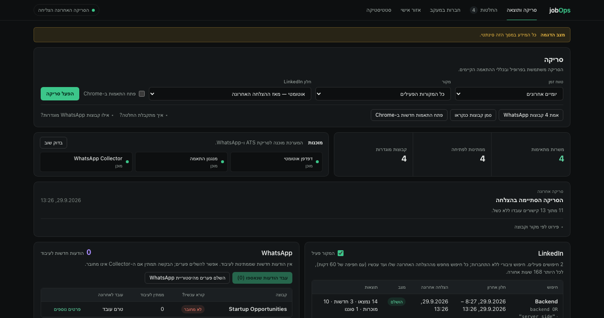
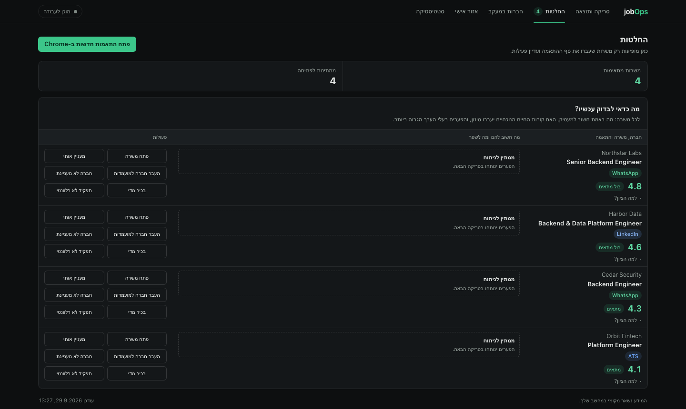
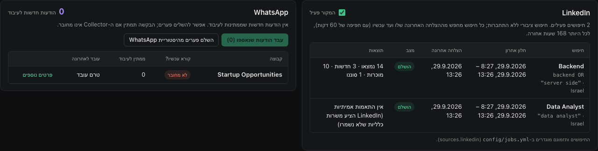

# jobOps

[](https://github.com/amirge118/jobops/actions/workflows/ci.yml)
[](https://nodejs.org/)
[](LICENSE)

**A local-first command center for the job search itself.**

Company career pages, private WhatsApp groups, and LinkedIn all surface real roles — and all
three are tedious to track by hand. jobOps scans them on a schedule, verifies each posting is
actually live, scores it against your own profile with a plain-language reason, and drops the
noise — so you only ever look at roles worth your time, and see them within hours of posting.

Job pages, your private candidate profile, and the exact resume snapshot are sent only to your
own signed-in ChatGPT session for scoring and resume-gap analysis. No API keys, no cloud database,
and no third-party application server are in the loop.



## What it does

- 🔎 **Scans everywhere roles actually appear** — ATS boards (Greenhouse, Lever, Ashby,
  Workable, Comeet, Workday, and more), your configured WhatsApp groups, *and* LinkedIn's
  public job search (no login, no stored session), in one run. Each LinkedIn search resumes
  from its own last successful window, stops on a block instead of working around it, and
  never reports a failure as "no jobs".
- 🧠 **Turns each match into resume work** — after the fit decision, a separate evidence-backed
  pass reads the posting the way its hiring manager wrote it: up to five ranked priorities (and
  whether your current resume shows each one), a recruiter's-eye estimate of whether that resume
  passes the first screen, and up to three critical gaps, separating facts that are safe to add
  from experience that must be confirmed or genuinely acquired.
- 📏 **Explains every score** — each fit dimension is scored on fixed anchors with hard caps, and
  carries a one-line evidence sentence you can open under "למה הציון?".
- ✅ **Verifies before it scores** — a dead or reposted listing never gets treated as a fresh
  match; liveness is checked, not assumed.
- 🔁 **One company + one role = one job** — the same role found on WhatsApp, LinkedIn and a
  company's own board collapses into one entry, whatever URL it came from. Company names ignore
  legal suffixes (Ltd, Inc, Technologies…); the company and title are read from the page *before*
  scoring, so a repeat is never scored twice and never shown again once decided. Extra links are
  kept only as technical duplicate rows. `npm run jobs:dedup` previews the one-off cleanup of
  older data; `-- --apply` writes it.
- 🚫 **Remembers companies you're done with** — "חברה לא מעניינת" on the decisions page blocks
  that company from then on: its new jobs are rejected locally, before any page fetch or
  scoring. Data/analytics/BI titles are excluded by `title_filter.negative` in `portals.yml`.
- 🏢 **Grows its own watchlist** — a company surfaced from a good WhatsApp lead becomes a
  tracked source with one click, no manual config editing.
- 🖥️ **A real dashboard, not just a CLI** — scan, review matches, and manage tracked companies
  from a local web UI at `127.0.0.1:4177`.
- 📊 **Learns from your choices** — every match gets a one-click decision: **applied** (also adds
  or updates its row in `data/applications.md`), or one of four reasons you did not apply — *not
  interesting* (the role fits, this job doesn't), *role not relevant*, *too senior*, *company not
  interesting* — or just *follow the company*. Only "not relevant" and "too senior" count as the
  score being wrong; the statistics page flags those to tune the anchors and the threshold.
- 📈 **Measures whether each source is worth it** — per source: what it found, what scoring it
  cost, what fit, which ATS companies actually produce matches, and which fits only one source
  found (and how many days earlier).
- 🙅 **Never applies for you** — it opens the real application URL in Chrome; you always send it.



## Runs on its own, three sources at a time



- 🔗 **LinkedIn, early and quiet** — public job search only (no login, no stored session). Each
  search asks LinkedIn only for what was posted since its own last successful run (a 30-minute
  overlap, capped at 16 hours), keeps only titles that match your target roles (a "data analyst"
  query no longer drags in FP&A or data-science roles), and reads the "3 hours ago" label on
  every card as a second check. A block or rate limit stops the search and is shown as such —
  never as "no jobs" — and coverage only moves forward after a complete run. The pause
  carries across runs: after a block, no run calls LinkedIn for an hour, and LinkedIn job
  pages shared on WhatsApp wait 15 minutes after any LinkedIn activity. Waiting jobs stay
  pending, are not counted as failures, and are read on the next run
  (`sources.linkedin.cooldown.afterBlockMinutes` / `afterActivityMinutes` in `config/jobs.yml`).
- 💬 **WhatsApp, processed when it is worth it** — the collector stores group messages locally
  for free. A token-free check every 30 minutes counts the *new jobs* waiting (unique, unseen
  links — one job shared in four groups counts once) and processes them once at least 8 are
  waiting or the oldest has waited 2 hours. Both numbers live in `config/jobs.yml`.
- 🏢 **ATS boards every hour** — a company's own board is where a job appears first (in our data
  it beat LinkedIn by a median of ~36 hours), and its public API costs no tokens. Each company
  keeps its own progress, so one failing board never holds the others back; companies that need a
  real browser to render are scanned every 6 hours.
- ⭐ **Watch the companies you like, automatically** — marking a job "applied" adds its
  company as a candidate. Once a day (13:20) every candidate is resolved on its own: Codex research
  if it was never researched, then a rendered visit to its careers site that reads ATS links, the
  ATS API calls the page makes in the background, and a repeated job-link pattern on the site
  itself. A source with jobs that carries the company's own name (or job links on its own site)
  starts being watched, labeled "added automatically"; everything else moves to a "cannot be
  scanned" list with the reason in plain words and a retry in 14 days
  (`npm run jobs:companies:resolve`; `npm run jobs:import-interested` catches up on past decisions).
- 📲 **A WhatsApp ping for strong jobs** — every new suitable job scoring 4.0+ is sent once to your
  own WhatsApp ("Message yourself") with the score, the posting, and a link to the decisions page
  (`notifications.whatsapp` in `config/jobs.yml`).

| Scan | When |
|---|---|
| ATS | every hour, 08:05–21:05 |
| LinkedIn | every 2 hours, 08:30–22:30 |
| WhatsApp smart check | every 30 minutes |
| WhatsApp full scan (history + read receipts) | 10:00 · 15:00 · 20:00 |
| Candidate companies → watched or "cannot be scanned" | 13:20 |
| Health check (token-free; alerts on new problems) | every hour, 09:50–22:50 |

`npm run jobs:schedule:install` installs them as macOS LaunchAgents; scans never overlap, and each
one logs to `logs/scheduled/<source>.log`, so a skipped or failed run leaves a trace.

## Knows what it costs, and stops when there is nothing left

Scoring runs on your ChatGPT plan through `codex exec`, so the real budget is your Codex usage
limit, not money.

- 🧮 **Every call is measured** — tokens in, cached, out, and reasoning, per purpose (scoring,
  resume analysis, company research), per run, and per day. The statistics page splits daily usage
  by source and shows **tokens per suitable job** for LinkedIn, WhatsApp, and ATS — the number
  that says which source is worth its cost.
- 💸 **A cheaper model by default** — `scoring.model` picks the model for every call (currently
  Codex's fast and affordable tier); a stronger model can be kept for resume analysis only.
- 🛑 **No quota, no run** — before each run jobOps checks whether the account still has Codex
  quota. If the limit was hit, it reads the reset time from Codex ("try again at 1:43 PM"), skips
  every scheduled run until then, and shows it on the dashboard. Nothing is lost: each source
  resumes from its last success (never more than `maxLookbackDays` back), and unscored jobs are retried automatically.

- 🩺 **Watches itself** — an hourly, token-free health check flags only what needs attention:
  a company failing scan after scan, a scheduled scan that stopped running, a run stuck without a
  heartbeat, a Codex failure streak (with the error's own reason) or exhausted quota, a LinkedIn
  search failing for half a day, a disconnected or flapping WhatsApp collector, messages waiting a
  day, failed jobs nobody retried. One-off failures that the next run recovers from stay quiet.
  Findings show in the "בריאות המערכת" box on the scan page ("בדוק עכשיו" re-checks), and a
  problem that is *new* sends one WhatsApp message to yourself (`npm run jobs:health-check`).

When something did fail, `/scan-health` audits the latest run of every source plus the scan
page's failure list (`npm run jobs:health` prints the read-only digest it works from), traces each
failure to its cause, and separates what to fix from what to accept.

## Measures how fast jobs reach you

The statistics page shows where time is lost between a job going live and your decision: the
hours from finding a job to deciding on it per source, how long LinkedIn takes to surface a
posting (from each card's "N hours ago"), which source saw the same job first and by how much,
how many wanted jobs come from companies you watch (and which ones you don't yet), and — from
`data/applications.md` — what happened after "applied".

## Shows what your CV is missing for a perfect fit

Every suitable job is checked against your exact current CV, and the result is kept after you
decide on the job. The personal area sums those checks across all of them, grouped by subject
(AI/LLM, languages, data, scale and infrastructure, work practices; years of experience and niche
domains collapsed at the bottom). It opens with **what's worth learning** — the 2–3 subjects that
recur across the most jobs and the terms to start from — then **CV fixes you can make now** (your
profile already proves them, the CV just doesn't say them), then a compact card per subject. Each
term shows how many jobs asked for it, how many required it, and whether to add, confirm, or learn
it. Terms your current CV already covers disappear — whether it says them verbatim or in other
words ("Model Context Protocol (MCP)" covers "MCP Servers"; Codex judges that once per CV change,
during the next scan or on demand with `npm run jobs:gap-coverage`) — so a CV edit visibly closes
the gap, even for jobs analyzed against an older CV. Mark what
you're working on as "in progress" and hide what's noise. On the decisions page each job shows the
estimate of whether your CV passes its first screen plus its top three gaps, so you can judge the
fit before applying.

## A compact, dark dashboard

Five pages — scan, decisions, tracked companies, personal area, statistics — share one dense,
dark design: a slim top bar, 13px type, one accent color, and every decision one click away
(open, applied, one of four reasons you did not apply, or follow the company).

## Try it in 60 seconds

The demo runs on synthetic companies and jobs — no WhatsApp, no ChatGPT login, no real data.

```bash
git clone https://github.com/amirge118/jobops.git
cd jobops
npm ci
npm run demo
```

## Run it on your own search

```bash
npm ci
npx playwright install chromium
npm run setup         # create private profile, preferences, and current-resume files
codex login           # sign in with ChatGPT — no API key needed
npm run start:local   # WhatsApp collector + dashboard
npm run dashboard:service:install  # optional: keep the dashboard running in the background
```

With the dashboard service installed, the dashboard starts at login, comes back after a crash,
and no longer depends on the terminal that started it.

Then open `http://127.0.0.1:4177` and configure your sources in `config/jobs.yml` and
`portals.yml`.

## Learn more

The [full technical reference](docs/TECHNICAL.md) covers every subsystem in depth: the scan
pipeline, the WhatsApp collector and its coverage guarantees, the dashboard's API surface,
diagnostics and retry behavior, and every engineering decision behind them. Architecture
decisions also live in [`docs/adr/`](docs/adr/).

## License

MIT — see [LICENSE](LICENSE). Adapted upstream components are credited in
[THIRD_PARTY_NOTICES.md](THIRD_PARTY_NOTICES.md).
