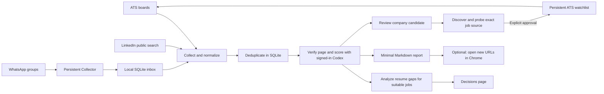

# jobOps — technical reference

This is the full engineering deep-dive: every subsystem, edge case, and design rationale in
jobOps. Start with the [README](../README.md) for the short overview, screenshots, and quick
start — come here for the details behind how each piece actually works.

`portals.yml` currently contains 91 companies, with 73 active scanner sources and 18 saved for
later investigation. The latest sector expansion starts from 14 selected
fintech, gaming, revenue-tech, and Web3 companies and maps five close peers to each one. That
research covers 68 unique companies; after two source audits, 38 use verified ATS sources and
another 15 use bounded, same-origin official HTML rules. The remaining active sources include
reusable Workday, Zoho Recruit, and TeamMe adapters. See the full rationale and source audit in
[`company-expansion-research.md`](company-expansion-research.md).

## Why jobOps

Most job-search tools begin and end with public job boards. In the Israeli tech market, useful
roles also arrive through private WhatsApp communities and are easy to lose, reread, or evaluate
inconsistently. jobOps treats the search as one local pipeline: collect, normalize, deduplicate,
verify, explain the fit, and keep only the matches worth reviewing.

The project is intentionally local-first. Personal profiles, WhatsApp credentials, scan history,
reports, and application state never need to enter source control or a hosted database.

## Try the demo

The fastest way to explore jobOps uses synthetic companies, jobs, groups, and scan results. It
does not connect to WhatsApp, read a candidate profile, invoke Codex, or modify real job data.

```bash
git clone https://github.com/amirge118/jobops.git
cd jobops
npm ci
npm run demo
```

The demo shows source health, four suitable jobs, transparent score breakdowns, dedup-aware
archiving, and the same dashboard used by the real workflow.

jobOps never submits an application. It can open matching application URLs in Chrome, but the
candidate reviews and submits them manually.

## What the unified scan does


```mermaid
flowchart LR
    A["ATS boards"] --> C["Collect and normalize"]
    L["LinkedIn public search"] --> C
    B["WhatsApp groups"] --> W["Persistent Collector"]
    W --> Q["Local SQLite inbox"]
    Q --> C
    C --> D["Deduplicate in SQLite"]
    D --> E["Verify page and score with signed-in Codex"]
    E --> X["Analyze resume gaps for suitable jobs"]
    X --> J["Decisions page"]
    E --> F["Minimal Markdown report"]
    F --> G["Optional: open new URLs in Chrome"]
    E --> H["Review company candidate"]
    H --> R["Discover and probe exact job source"]
    R -->|"Explicit approval"| I["Persistent ATS watchlist"]
    I --> A
```

The decision stays deliberately small: `מתאים` or `לא מתאים`, with `בול מתאים` as the
high-score label. A missing programming language or framework can lower the score, but is not
an automatic blocker. Only basic incompatibilities such as an inactive posting, wrong role
domain, incompatible location, or missing application URL block a match.

The report stays intentionally minimal and contains only:

- company
- short job description
- score
- match label
- one decision reason
- application URL

The Decisions page is intentionally different from the archival Markdown report. It shows four
columns only: company/role, combined score and fit label (per-dimension scores and evidence stay
collapsed under "למה הציון?"), the recruiter-screen estimate plus the job's top three resume gaps
(the analysis orders them by screening impact), and uniform decision actions. It does not repeat
strengths. Each gap is labeled as a verified safe addition, a real experience gap, or something the
candidate must confirm.
## Quick start

Requirements: Node.js 22+, npm, Google Chrome, and Codex CLI signed in with ChatGPT. No model
API key is required. Playwright's Chromium is used only when a regular HTTP check cannot
determine whether a posting is active.

```bash
npm ci
npx playwright install chromium
npm run setup
codex login
npm run doctor
```

`codex login status` must report `Logged in using ChatGPT`. Fill in the three private files:
`profile/01-candidate-profile.md`, `profile/02-preferences.md`, and an exact text snapshot of the
resume currently being sent in `profile/03-current-resume.md`. Then configure sources in
`config/jobs.yml`. On macOS, jobOps automatically finds the Codex binary bundled with the ChatGPT
desktop app; `CODEX_BIN` is available as an override.

```bash
npm run jobs -- --dry-run --ats-only  # safe ATS preview
npm run jobs -- --days 2              # scan the last two days
npm run jobs -- --days 2 --open       # also open new matches in Chrome
npm run jobs:open                      # open matches that were not opened yet
npm run jobs:verify-groups             # confirm configured WhatsApp groups still exist
npm run whatsapp:collector             # keep receiving WhatsApp messages in this terminal
npm run jobs:import-whatsapp-links -- --group "GROUP" --file links.json # one-time browser/export backfill
npm run jobs -- --whatsapp-backlog --days 7 # process seven days already queued locally
npm run jobs -- --whatsapp-backlog          # process the next bounded history batch
npm run diagnostics -- --latest        # print the newest safe diagnostic record
npm run jobs:schedule:install          # unattended scans: WhatsApp 10/15/20, ATS at 14:00
npm run start:local                    # recommended: Collector + dashboard from macOS Terminal
npm run stop:local                     # stop only this project's dashboard
npm run restart:local                  # stop stale dashboard and start a clean one
npm run web                            # open the local dashboard in Chrome
```

On macOS, the simplest reliable launch is to double-click `start-jobops.command` in Finder. If
macOS blocks it the first time, right-click the file and choose **Open**. It starts the WhatsApp
Collector service when needed and opens the dashboard from Terminal, outside automation
sandboxes that can block Chromium or the signed-in Codex scorer. The equivalent manual command is:

```bash
cd /path/to/jobOps
npm run start:local
```

Use `restart-jobops.command` when the site is stale or a previous server still owns port `4177`.
Use `stop-jobops.command` when you want to shut down only the dashboard. Both commands verify that
the listener belongs to this jobOps checkout before signaling it, so they do not terminate unrelated
Node.js processes. The WhatsApp Collector is a separate background service and remains active after
the dashboard is stopped.

The dashboard runs only on `127.0.0.1:4177` and redirects `/` to `/scan`; the focused pages are:

- `/scan` — run a scan, inspect source health, review per-group coverage, and diagnose failures.
- `/decisions` — review suitable jobs and record a decision for each (interested, company to track,
  company not interesting, too senior, role not relevant); every decision archives the job.
- `/companies` — inspect the watchlist, resolve a careers URL, and explicitly approve sources.
- `/personal-area` — "what's missing for a perfect fit": gap terms aggregated across every analyzed
  suitable job (`GET /api/personal-area/insights`, `scripts/jobs/gap-insights.mjs`), grouped into
  subject topics by a fixed term dictionary (`GAP_TOPICS`; first match wins, unmatched terms fall
  into "other" — zero tokens, no re-analysis). A topic counts each job once and topics rank by job
  count. The response carries `focus` (up to 3 learnable topics seen in at least 2 jobs, with their
  most recurring terms), `quickFixes` (profile-backed `safe_addition` terms not yet in the resume),
  and `topics`; years, niche domains and "other" are `minor` and render collapsed. Terms the
  current `profile/03-current-resume.md` already contains (normalized substring; whole word for
  keys under 4 chars) are dropped and only counted in `coveredByResume`, since older analyses ran
  against older resumes. Coverage in other words is judged by Codex (`scripts/jobs/gap-coverage.mjs`,
  purpose `gap_coverage`, one call per 100 terms): each scan, after the resume-gap analysis, asks only
  about displayed terms not yet judged for the current resume, and caches the answers in
  `gap_term_coverage` keyed by resume hash + `GAP_COVERAGE_VERSION` (answers for older resumes are
  deleted). An unchanged resume costs no call; a failure is logged and retried next scan, never
  failing the scan. `npm run jobs:gap-coverage` runs the same check on demand. Each term can be
  marked "in progress" (it leads its topic) or hidden as noise (`POST /api/personal-area/term-status`, table `gap_term_statuses`,
  keyed by the same normalized term the aggregation groups by). The older manual tracking list
  (`personal_improvements`) is no longer read; its rows were carried over as "in progress" terms.
- `/decision-stats` — what you did with the jobs you were shown, and where the score disagreed.

All pages use the same SQLite store. A scan keeps running in the local server process when the
user moves between pages. Only one action can run at a time, and the scan page displays its live
output. Page-specific APIs avoid downloading jobs, companies, and diagnostic history everywhere.
It does not add a second database or duplicate the scanner's decision logic.
The architecture decision and its trade-offs are recorded in
[`docs/adr/0002-multi-page-dashboard.md`](adr/0002-multi-page-dashboard.md).

The scan page's WhatsApp section has two actions. **Process collected messages** evaluates links
already received during the last seven days. **Fill history gaps** stores the last collected
timestamp separately for every configured group, waits safely while the Collector is offline, and
asks the connected Collector to resume from those captured cursors. The group table shows the last
collection time and the latest received, linked, suitable, failed, and pending counts. WhatsApp may
decline a linked-device history request; this is reported per group as `history_no_response` rather
than being presented as an empty group. Pending message bodies older than seven days are erased while
their minimal deduplication identity is retained.

### Scheduled scans

A scan can run unattended on a fixed schedule instead of only from the dashboard button. Three
independent macOS LaunchAgents are available: WhatsApp groups at `10:00`, `15:00`, and `20:00`;
ATS every hour from `08:05` to `21:05`; and LinkedIn every two hours from `08:30` to `22:30`.
The slots never coincide, and the ATS and LinkedIn agents wait up to 20 minutes for the scan lock
instead of skipping. Hourly ATS is cheap: the public board APIs cost no tokens, and Codex only
scores new titles that pass the filters. A company rendered in a headless browser is scanned at
most every 6 hours (`BROWSER_SCAN_INTERVAL_HOURS` in `sources/ats.mjs`); skipping keeps its old
last success, so its own window still covers the hours in between. Short LinkedIn windows mean
few pages per run, so the total request count stays close to the old three long runs. None of
them passes `--open`, so unattended matches wait for review on `/decisions` rather than opening a
flood of Chrome tabs while no one is watching. Each agent writes stdout and stderr to
`logs/scheduled/<key>.log`, so a skipped run (lock, cooldown, quota) or a crash leaves a trace.

```bash
npm run jobs:schedule:install    # install all LaunchAgents (three scans + the WhatsApp trigger)
npm run jobs:schedule:status     # confirm they're loaded and see each schedule
npm run jobs:schedule:uninstall  # remove all three; the database and config are untouched
```

The schedule itself lives in `SCHEDULES` in
[`scripts/jobs/scheduled-scan-service.mjs`](../scripts/jobs/scheduled-scan-service.mjs) — edit
the `times` array for either entry and reinstall to change it. Each entry becomes its own
LaunchAgent (`com.amirgefen.jobops.scan-ats`, `com.amirgefen.jobops.scan-whatsapp`,
`com.amirgefen.jobops.scan-linkedin`) because one
`StartCalendarInterval` always fires the same fixed command, so a source that runs at several
times a day and one that runs once cannot share a single agent.

A scheduled run and a manually triggered dashboard scan are separate OS processes with no shared
state, so the dashboard's own "only one action at a time" bookkeeping cannot see a launchd-fired
scan. `runJobs()` therefore takes a single-instance file lock
(`data/.scan.lock`, via the same `acquireSingleInstance` the WhatsApp Collector uses for its own
session) before writing anything: if another scan is already in progress, it logs that and exits
cleanly rather than risk two writers on the same SQLite database at once. A dry run is exempt,
since it never touches the real database. This is a rare collision in practice, not something to
watch for day to day.

macOS does not run a `StartCalendarInterval` job while the Mac is asleep; launchd runs it once on
wake instead, coalescing every slot missed during sleep into a single run. Each source resumes
from its own progress, so that one run covers the whole gap. A Mac that sleeps through the
working day still delays jobs until it wakes, so keep it awake (or on power) during the hours you
want jobs to arrive quickly.

#### Smart WhatsApp trigger (every 30 minutes)

The persistent Collector stores group messages locally at no cost; only processing (page reads
and Codex scoring) uses ChatGPT/Codex quota, and every Codex batch resends a fixed ~2.4k-token
prompt. `scripts/jobs/whatsapp-trigger.mjs` therefore runs every 30 minutes as its own
LaunchAgent (`com.amirgefen.jobops.whatsapp-trigger`, `StartInterval` 1800) and spends no tokens
deciding. It counts the **new jobs** in the collected backlog: unique job links from pending
messages that are not already in SQLite and are not known non-job links (a link shared in all
four groups counts once). It then starts the same local-backlog processing as the dashboard's
"עבד הודעות שנאספו" button only when:

- at least `sources.whatsapp.trigger.minNewJobs` new jobs are waiting (default 8, a well-filled
  batch, about 12% fixed-prompt overhead per job), or
- the oldest new job has waited `maxWaitMinutes` (default 120), so nothing sits for long.

The check itself never records, marks, or fetches anything. `npm run jobs:whatsapp-trigger` runs
it once by hand. The fixed WhatsApp scans at 10:00, 15:00, and 20:00 remain for history coverage
and read receipts.

### Two-minute dashboard workflow

1. Run the scan and review only the suitable jobs.
2. Decide on every match. **מעניין אותי** opens the posting and records the decision in one action
   (if Chrome blocks the new tab or recording fails, the job remains active). **העבר חברה
   למועמדות** adds the company as a tracking candidate. Under **לא בשבילי**, pick the reason:
   **חברה לא מעניינת**, **בכיר מדי**, or **תפקיד לא רלוונטי**. Each decision removes the job from
   the list; **פתח משרה** only peeks and records nothing.
3. Use **בדוק חברה למעקב** on a useful WhatsApp/ATS result. jobOps inspects the final application
   URL (after a short-link redirect), identifies a supported job source, and saves a preview only.
4. Select **אשר והוסף למעקב** only when the preview is correct. The source joins the next scan.
5. Pause or ignore companies from the company table; `portals.yml` will not overwrite that choice.

The company page offers two explicit flows. **Research by name** runs a live web search through the
locally signed-in Codex CLI (ChatGPT login, no API key), collects up to five official or dedicated
career-source candidates, and then verifies them with deterministic provider code. It follows
bounded public redirects, detects supported ATS URLs embedded in official pages, and runs the real
provider before showing the result. The preview distinguishes verified jobs, a healthy empty board,
a blocked source, a failed source, and a page that still needs an adapter. It also shows up to three
sample jobs. The result remains a candidate until explicit approval. **Add a known URL** resolves
locally and deterministically without a network request. Supported public board URLs are
Greenhouse, Lever, Ashby, Workable, Recruitee, SmartRecruiters, Comeet, Workday, Zoho Recruit,
TeamMe, and explicitly configured official HTML pages. Each hiring platform has one reusable
adapter; companies supply only a board URL and, when an acquired brand shares a Workday board,
an optional `search_text`. Official HTML rules use one bounded HTTP response, reject redirects, and
return only same-origin links matching the configured path shape. Other unsupported URLs stay
visible as candidates but cannot be approved until a supported source is known. Research input
and model output are length-bounded, all returned URLs must be public HTTPS URLs, only one research
run may execute at a time, and approval remains a separate user action. Untrusted discovery pages
have DNS/private-network checks, at most four redirects, a 15-second timeout, a 2 MB response limit,
and an HTML content-type check. Provider probes retain their existing host allowlists.

Company state and source verification are separate. `paused` remains a user/catalogue tracking
choice; source verification records `verified_jobs`, `verified_empty`, `blocked`, `failed`,
`needs_adapter`, `external_only`, or `stale`, together with a bounded reason and last observed job
count. This prevents a working board with zero openings from looking like a failed scan.

Dashboard read endpoints are deliberately small and local-only: `GET /api/summary`,
`GET /api/scan`, `GET /api/readiness`, `GET /api/jobs`, `GET /api/companies`, and
`GET /api/linkedin`. LinkedIn searches are read-only in the dashboard; the only LinkedIn mutation
is `POST /api/linkedin/enabled`, which switches the whole source and requires a JSON content type.
Company mutations remain
`POST /api/companies/research`, `POST /api/companies/resolve`, `POST /api/companies/:id/watch`, and
`POST /api/companies/:id/status`. Request bodies are bounded and validated; approval is idempotent,
and the browser never supplies provider or board identifiers for a watch decision.

### LinkedIn job search

LinkedIn is an optional third discovery source that reads LinkedIn's public, logged-out job search
(`jobs-guest` endpoints). jobOps never logs in, never stores a LinkedIn session or password, never
solves a CAPTCHA, and stops on the first block. Postings then follow the same path as every other
source: dedup in SQLite, page verification, Codex scoring, and resume-gap analysis.

```bash
npm run jobs:linkedin                             # LinkedIn only, automatic windows
npm run jobs -- --linkedin-only --linkedin-hours 12  # LinkedIn only, a manual 12-hour window
npm run jobs:linkedin-probe                       # bounded read-only health check of the endpoint
```

**Searches.** `sources.linkedin.searches` in `config/jobs.yml` is the only place searches are
defined; each needs a unique `key`. Editing a search's keywords or location starts a fresh coverage
history for it, renaming it does not, and removing it disables it while keeping its history. The
scan page shows the active searches and their status read-only, plus a switch that turns the whole
source off without affecting ATS or WhatsApp. The defaults search Backend, Data
Engineering, and Data Analyst roles across `Israel` and keep only cards in the Tel Aviv and Center
districts (plus postings tagged just "Israel"). LinkedIn matches keywords against the whole
description, so a "data analyst" query also returns FP&A, planning, and data-science roles. Each
search therefore lists `titleIncludes` terms, and a card is kept only when its title contains at
least one term from **any** configured search as a whole word ("java" never matches "javascript";
Hebrew gendered forms such as "מנתח-ת" are normalized). On live data this kept 16 of 77 cards, all
of them target roles. Titles then pass the same negative keyword list as WhatsApp (`portals.yml`
`title_filter.negative`); there is no seniority, sector, or Easy Apply filter. Editing
`titleIncludes` does not reset a search's coverage.

Each card also carries LinkedIn's relative age label ("3 hours ago"). It is read as a lower bound
on the posting's age: a card older than the window (plus one hour of slack) is dropped and counted
as out of window, and a page made only of such cards ends pagination. This backs up LinkedIn's own
`f_TPR` filter, which was honored in testing.

**Time windows.** Each search has its own coverage point (UTC; displayed in local time):

- Automatic mode searches from the last successful coverage minus `overlapMinutes`.
- A new search, or one whose keywords or location changed meaningfully, starts from
  `initialLookbackHours`. Renaming a search keeps its coverage.
- After the computer was off, the catch-up is capped at `maxBackfillHours`; anything older is
  recorded and shown as an uncovered gap instead of being silently absorbed.
- Manual mode (`--linkedin-hours`, or the dashboard's "חלון LinkedIn" field) searches the chosen
  number of hours and only extends coverage when it reaches back to it.
- Coverage advances only after a complete collection whose postings were saved. A partial, capped,
  or failed search never advances it, so the next run retries the same stretch. The pagination
  position is never reused as a time anchor.
- A clock that moved backwards restarts from the initial window with a warning.

**Failure states.** Each search ends as `complete`, `partial`, or `failed`, with a reason:
`blocked` (HTTP 999, authwall, or a sign-in page), `rate_limited` (HTTP 429), `structure_changed`
(content arrived but no card could be read), `network_error`, `timeout`, `capped` (page limit
reached before the window was covered), or `empty_unverified` (an empty answer while no other
search in the run proved the endpoint was answering). A block halts every remaining LinkedIn
request in the run. LinkedIn answers an unmatched query with unrelated "popular" jobs rather than
an empty page, so a page whose titles share almost no term with the query is treated as "no real
matches" and nothing from it is stored or scored. None of these outcomes is shown as "no jobs".

**Reading postings.** Descriptions come from the public posting page through plain HTTP (never
the automated browser), paced, capped per run (`maxDetailFetchesPerRun`), and behind a circuit
breaker. A posting that cannot be read stays pending with a `linkedin_*` reason and is retried by
the next run or by "retry failed" without searching again. It is never marked "not suitable".

**Identity.** A LinkedIn posting is keyed by its numeric posting id, so subdomain, slug, and
tracking-parameter variants, and a LinkedIn link shared in WhatsApp, all collapse into one job
that remembers every discovery source. LinkedIn never merges on company and title alone: a twin
is created as its own job and flagged `possible_duplicate_of`, shown on the Decisions page as
"ייתכן כפילות". Archived and rejected postings are never revived by a new sighting, and a rejected
posting keeps only its technical identity. A LinkedIn failure never holds back the ATS/WhatsApp
scan window, because each run also records a window status judged without LinkedIn.

**Limits** (`sources.linkedin.limits`): pages per search, requests per run, posting reads per run,
delays between requests, and a run time budget. The UI shows when a limit prevented full coverage.

**Known limitations.** The guest endpoints are unofficial and can change or be throttled from a
single IP. Logged-out pages usually hide the company-site apply link, so most postings keep their
LinkedIn URL. `sortBy=DD` is sent but was not honored in testing, so collection never depends on
sort order. Listing dates are day-granular.

### Understanding failures

The scan page checks readiness before starting: Chromium, the signed-in Codex scorer, and the
WhatsApp Collector. An ATS scan requires the first two; a WhatsApp scan requires all three. An
impossible scan is rejected before collecting hundreds of jobs. The newest result is presented as
one outcome with deduplicated root causes and a concrete next step. Per-source and per-group counts
remain available under **פירוט לפי מקור וקבוצה**, while only the run ID and safe failure codes are
shown under **פרטים לתמיכה**.

For example, `permission_denied` means the OS refused file access, `timeout` means a time limit
expired, and `coverage_incomplete` means WhatsApp did not prove that all messages in the time
window were received. None of these is a "not suitable" decision. ATS collection errors,
message-processing errors, failed read receipts and page/scoring failures make the run incomplete.
The diagnostics are operational evidence, **not an AI reasoning transcript**.

Each source summary is saved before starting the next source. A five-second heartbeat and
process ID help distinguish active work from an interrupted process. SIGINT/SIGTERM and uncaught
exceptions record a terminal event when storage is available. SIGKILL/power loss cannot record a
cause: on the next dashboard read, an absent recorded process is shown as interrupted with an
unknown cause. A stale heartbeat is unconfirmed, not proof of a crash; PID reuse can also make
process liveness ambiguous. Legacy unfinished scans without an owner PID remain unconfirmed.
Historical missing logs cannot be reconstructed. No old run is rewritten by this observation.

Diagnostics use the existing private `data/jobs.db`: `runs`, `run_events`, `action_runs`,
`collector_runs`, and `collector_events`. Retention runs at dashboard startup and after completed
scans/actions. It keeps detailed evidence for the newest three scans, actions, and Collector runs.
Older failed records are deleted. The latest successful run for each exact source set is retained
as a compact checkpoint without events or diagnostic payloads so incremental scan windows continue
to work. Job deduplication, WhatsApp message IDs and anchors, company state, and archived jobs are
never part of diagnostic cleanup.

Durable diagnostics never store raw subprocess output, QR codes, WhatsApp message bodies,
credentials, arbitrary exception text or full stack traces. Unclassified errors are explicitly
unknown rather than copied verbatim. The temporary live-output panel is separate and its limited
redaction is **not** a guarantee that arbitrary third-party output is safe to share. Share the
structured support details instead. If SQLite itself is unavailable, the UI/terminal reports a storage
failure; persistence cannot be guaranteed until permissions or disk space are fixed. A CLI failure
before opening SQLite/starting a run has no run record; dashboard-launched commands still have an
action record. External launchd failures before Node starts remain in the launchd logs.

The CLI command `npm run diagnostics -- --latest` prints the newest bounded technical record when
deeper support evidence is needed. Read-only detail endpoints remain available for the three recent
records and accept bounded numeric IDs only. The older `/api/state` endpoint remains available for
compatibility. After updating code, stop the old server with Ctrl+C and run `npm run web`
again (wait for any active scan to finish first). A browser refresh alone does not reload the Node server.

The source-health panel distinguishes "no new jobs" from a failed or incomplete collection run.
It reports ATS errors, WhatsApp message/link counts, configured groups found, and the last-run
result. The Decisions page combines the final score and fit label, then focuses on actionable
resume gaps instead of exposing per-criterion score breakdowns. The Markdown report remains minimal.

Only suitable active jobs appear in the dashboard and reports. A rejected job keeps only its
canonical identity and cache hashes required to prevent duplicate work; its company, title,
description, score, decision reason, and source details are discarded.

### Persistent WhatsApp collection

Run `npm run whatsapp:collector` before relying on WhatsApp scans. It keeps one linked-device
connection alive while the Mac is awake, durably queues messages from the configured groups, and
sends read receipts only after local persistence. A later `npm run jobs -- --days 2` consumes that
inbox and evaluates the linked pages without opening a second WhatsApp connection. Closing the web
dashboard does not stop the Collector.

The source-health panel shows the Collector ID, connection state, and received/queued totals. Every
Collector process has its own heartbeat and event timeline. Share a visible identifier such as
`Collector #12`, `Scan #41`, or `Action #9` for diagnosis on the same machine, or inspect it with:

```bash
npm run diagnostics -- collector 12
npm run diagnostics -- run 41
npm run diagnostics -- action 9
```

After a successful foreground test, macOS can start the Collector at login:

```bash
npm run whatsapp:collector:install
npm run whatsapp:collector:status
```

Use `npm run whatsapp:collector:uninstall` to remove only the LaunchAgent; the database and auth
session are preserved. Background mode suppresses QR output, so pairing is always performed with a
foreground `npm run whatsapp:collector`. See the
[Collector runbook](whatsapp-collector-runbook.md) and
[architecture decision](adr/0001-persistent-whatsapp-collector.md).

On first WhatsApp use, the terminal shows a QR code. Pair it from WhatsApp under **Linked
devices**. The local `auth/` directory contains sensitive session credentials and must never be
committed or shared. WhatsApp access uses the unofficial Baileys client, so upstream WhatsApp
changes can occasionally require a dependency update or a new pairing.

WhatsApp read state is separate from scan success. With `sources.whatsapp.markRead: true`, the
Collector sends read receipts **only after an incoming configured-group message is durably queued**.
The message may still be waiting for URL extraction or job-page evaluation, so a receipt is not an
"interesting job" decision. When no Collector is active, the legacy one-shot scan sends receipts
only after URL extraction succeeds. Empty scans never fall back to old stored IDs or mark the whole
chat read. Receipts are sent in batches of 100; one-shot scans also use a 10-second acknowledgement
timeout and retain the count acknowledged so far.
The UI reports sent, skipped, or failed independently of coverage. A successful API call is not
proof that the phone's unread counter cleared. No other chats are touched, the scanner uses
`markOnlineOnConnect: false`, and it never sends a chat message.

The separate, explicit `npm run jobs:mark-read` action still supports configured-chat state and
old stored-ID fallbacks, without running job scoring. Its output identifies these methods; they
must not be interpreted as evidence of messages received by the current scan.

If WhatsApp declines an on-demand history request, a browser-assisted or exported JSON array of
links can be imported with `jobs:import-whatsapp-links`. The importer accepts only configured group
names, canonicalizes and deduplicates URLs, stores no surrounding chat text, and is safe to rerun.
Imported links remain pending until `npm run jobs -- --whatsapp-backlog` fetches the destination
pages and evaluates them. One backlog run processes up to 500 stored messages per group.

Keep `authPath` inside this project so Baileys can safely refresh its session files. When moving
from the standalone `whatsappJobsScanner`, copy its existing private `auth/` directory into this
project once and set `authPath: "auth"`; the original session can remain untouched. Import its
message-level dedup state once with `npm run jobs:migrate-whatsapp`. The import is idempotent and
never moves a newer checkpoint backwards. After migration, avoid running both scanners at the
same time so two copies of the same linked-device session do not update independently.

Each run reports ATS counts and, for every configured WhatsApp group, the number of messages and
job links processed. Collector runs separately report live/history ingress, connection continuity,
and read receipts. Messages are accepted only
from the configured group JIDs. Their bounded text is kept in the local SQLite inbox only while the
message is pending or failed; after successful processing, the text is erased and only dedup
metadata remains.

The local dashboard includes a per-source and per-group audit funnel. WhatsApp coverage is marked
`complete`, `partial`, `unknown`, or `failed`; a run with unproven coverage is persisted as
`incomplete` rather than a successful empty scan. Safe structured audit events are stored in the
local SQLite database with the run ID, stage, status, counts, and bounded metadata. Credentials,
session material, and full message bodies are never copied into audit events.

After URL extraction, scoring uses only the fetched job page—not the WhatsApp message text. The
dashboard reports, for ATS and for each WhatsApp group, how many unique links were read, matched,
rejected, failed, or had already been processed. Rejected roles retain only technical identity and
evaluation hashes for deduplication; their description, decision details, source label, and cached
page text are removed.

“New” in the phone UI and “history” in the scanner are not opposites. A message that arrives while
JobOps is stopped is new to the user, but on the next scanner connection it is an offline gap that
WhatsApp must sync. JobOps uses a Desktop identity with `syncFullHistory: true`; it does not
guarantee that the server will deliver the offline gap.

### Local backlog and durable history requests

The scan page separates two operations that used to look identical. **Process local backlog** reads
messages already stored in `data/jobs.db`; it can process the last seven days or the next bounded
batch, newest first. Each action handles at most 100 messages per configured group. It extracts URLs
locally, evaluates the fetched job pages through the normal pipeline,
and erases each message body after successful URL extraction. These runs use the separate
`whatsapp-backlog` source key, so they cannot advance the successful live-scan window.

**Request history from the Collector** creates one durable 7-, 30-, or 90-day request. The active
Collector claims it and uses its existing WhatsApp socket—never a second connection with the same
credentials. The dashboard keeps per-group progress: request state, batches, delivered messages,
newly queued messages, duplicates, and a bounded failure reason. If the owner process dies, the next
Collector returns the request to the queue. A request is counted only when its delivered history
event matches the session identifier returned by Baileys.

### Empty connections and bounded history recovery

After connection warm-up, each configured group can wait up to 60 additional seconds for a recent
real message. Groups wait concurrently. Recovery uses the newest genuine message from the current
buffer, current-chat metadata, or the local `whatsapp_anchors` table. That table stores only one
validated message key and timestamp per configured group, not message text. Legacy dedup IDs are
not converted into cursors because they lack the original full key.

The [Baileys history API](https://github.com/WhiskeySockets/Baileys/blob/master/README.md) paginates
**backwards** from a real message. A saved old cursor cannot request messages newer than itself.
Each group has a three-minute recovery budget, at most 20 requests of 50 messages, and bounded
12-second request/response waits. Mixed old and new buffer entries alone do not prove coverage;
pagination tracks actual history deliveries, including repeated IDs, separately from live upserts.
On-demand pages are correlated with `peerDataRequestSessionId`, so an unrelated initial history
event cannot be counted as the response to the active request.

Coverage is complete only when pagination reaches the start of the requested window and the
anchor reaches its end. Quiet groups can therefore remain conservatively partial even if their
available messages were processed. The dashboard reports a specific cause such as `missing_anchor`,
`anchor_too_old`, `history_no_response`, `history_request_timeout`, or `newer_messages_unverified`,
alongside recovery requests, delivered messages, and job outcomes. Zero delivery is not a clean
empty inbox. If recovery still fails, keep the phone online, check Linked devices, and try again
after a new message arrives in that group. Re-pairing is a possible later troubleshooting step,
not an automatic action or a guaranteed fix. The scanner never resets credentials automatically.
The Baileys 6 line is pinned to `6.7.24` so a reinstall cannot silently change linked-device
behavior.

### Automatic company resolution

`scripts/jobs/company-auto-resolve.mjs` runs daily at 13:20 (LaunchAgent
`com.amirgefen.jobops.resolve-companies`) over every `candidate` company that was never checked or
whose retry time has come. Each one ends in exactly one of two places:

1. **Watched**: a source that returned jobs *and* evidently belongs to the company. It is labeled
   "added automatically" on the companies page.
2. **Cannot be scanned**: a reason code in `companies.auto_reason` that the companies page explains
   in plain words, retried after 14 days (`auto_next_at`).

The steps, in order:

- **Research** (one Codex call) only for a candidate never researched, such as one added from an
  "interested" LinkedIn job that only carries the job's own URL.
- **Known sources** are re-probed under the identity rule below.
- **Each careers page** of the company (never job boards such as LinkedIn) is rendered in a
  headless browser (`company-page-discovery.mjs`). Three things are read from it:
  - ATS links in the page and in script-built links.
  - ATS API calls the page makes in the background. A Comeet `careers-api` call with its public
    token yields the public board through the positions' `url_comeet_hosted_page`.
  - A repeated same-site job-link shape: at least three links sharing a prefix, in a careers-like
    section or with role-like texts. It becomes an `official-html` source, tried without and then
    with browser rendering.
- **One hop** to an "open positions" page when the first page held none of those.

**Identity rule.** An ATS board belongs only when its own board name or host carries a
non-generic word of the company name. Job links read off a site also belong when that site's
host names the company. A board merely embedded in the company's site does not count:
Lumia Security's careers page embeds its investor Team8's whole Comeet board. Such a board is
saved, but not watched, under `board_name_mismatch`, so one click can approve it when it is right.

**Reasons:**
- `job_boards_only`
- `no_careers_site`
- `unsupported_platform`: for example Oracle Recruiting, iCIMS, BambooHR.
- `board_name_mismatch`
- `aggregator_page`: a page linking three or more boards.
- `board_unavailable`
- `no_jobs_found`

`--dry-run` reports without saving, and `--company <name>` checks one company now.

### Notifications for strong jobs

A scan run queues one WhatsApp message per new suitable job scoring at least
`notifications.whatsapp.minScore` (4.0) in `notification_outbox` — one row per job, so a job is
never announced twice. It never sends anything itself: the WhatsApp Collector owns the only
connection, and its connected loop (the same 2-second poll that serves history requests) sends
pending messages to the account's own chat ("Message yourself", from `sock.user.id`) and to no
one else. A failed send is retried up to five times; a message older than a day is dropped
rather than sent late. Set `notifications.whatsapp.enabled: false` to turn it off.

## Codex scoring without API billing

### Token accounting, model choice, and quota checks

Every Codex call runs `codex exec --json`. The final agent message is the structured answer, and
`turn.completed` reports input, cached-input, output, and reasoning tokens. Each call is stored in
the `codex_calls` table (purpose, model, jobs in the batch, tokens, duration, outcome; kept for 90
days). Each CLI run prints a token line, and the scan page's "צריכת Codex" panel shows 24-hour and
7-day totals per purpose, tokens per scored item, and a per-run breakdown.

`scoring.model` in `config/jobs.yml` selects the model for all Codex calls (currently
`gpt-reserve`, Codex's "fast and affordable" tier). Without it, `codex exec` uses its own default
model, because `--ignore-user-config` deliberately ignores your personal Codex config.
`scoring.reasoningEffort`, `resumeGap.model`, and `resumeGap.reasoningEffort` are optional
overrides.

A ChatGPT account's Codex usage limit is checked before every run at no cost. Codex records the
account's usage windows (5-hour and weekly: percent used and reset time) in its own local session
files (`~/.codex/sessions/**/rollout-*.jsonl`, `token_count` events); jobOps reads only the newest
`rate_limits` object from the tail of the most recent files, never conversation content. A window at
100% that has not reset skips the run until it does, and the dashboard shows both windows. A stored
block from a rejected call (with the reset time Codex reports, e.g. "try again at 1:43 PM") also
skips the run. No test call is made — measured, even a one-word `codex exec` call costs ~14k input tokens of Codex's own
agent instructions, while a call rejected for the limit costs nothing, so simply running is the
cheapest check. That same fixed ~14k per call is why `scoring.batchSize` is 10: a larger batch
spreads it over more jobs.
When the limit is hit mid-run, the rest of that run makes no further Codex calls, and the unscored
jobs stay pending for automatic retry. Scheduled runs and the WhatsApp trigger skip entirely while
blocked, and every source resumes from its last success afterwards. The dashboard shows the block as
a readiness blocker until it resets.
The fit prompt scores every dimension (`cvMatch`, `seniority`, `roleScope`, `location`, `sector`)
against fixed anchor bands and hard caps (for example, `cvMatch` 5 requires every stated must-have
to be evidenced; an unstated fact is scored as unknown, never as the favourable case). The schema
requires one evidence sentence per dimension; these are stored in `fitBreakdown.evidence` and shown
on demand in the decisions table. Changing anchors requires bumping `decision.criteriaVersion`,
which re-scores jobs still in the scan window. The suitability threshold is
`decision.minimumScore` (currently a 3.6 trial, down from 4.0).

Suitable jobs then enter a separate resume-gap pass. Its cache key contains the job-content hash,
candidate-profile hash, exact-resume hash, and analysis version. The pass returns at most six
items — everything between the resume and a perfect match, ordered by screening impact — each with
a canonical English `term` (so the same gap groups across jobs) and a `category`
(`tool` / `experience` / `keyword`), and may classify a keyword as safe to add only when the private profile contains supporting
evidence and the exact resume does not already contain it. The same call also returns up to five
`employerPriorities` (ranked by the posting's own emphasis, each with a `critical`/`important`/`nice`
weight and `strong`/`partial`/`missing` coverage in the exact resume) and a `screenPass`
(`high`/`medium`/`low` with the deciding factor), judged only from the resume text. Analysis failures are stored separately:
they never change the fit decision, hide the job, or fail the source scan.

Each successful analysis is also copied to `gap_observations` (job key, company, title, score,
resume hash, and the items and priorities — never page text or `screenPass`). Unlike
`resume_gap_json`, this row survives the decision and archive wipe and follows its job through
company+role dedup, so the personal area can aggregate gaps over every suitable job ever analyzed.
Aggregation weights a job at score ≥ 4 as 1.5, adds 1 when the item is required (or the priority is
critical) and 1 when the job was marked interested; terms found in the current resume sort last.

New active jobs are scored through `codex exec`, authenticated with the local ChatGPT login.
The child process is forced to the `chatgpt` login method, ignores API-oriented user config,
does not inherit `OPENAI_API_KEY`, and runs in a read-only ephemeral sandbox. Jobs are grouped
in batches of eight by default to reduce repeated context.

This avoids usage-based OpenAI or Anthropic API billing. It still consumes the included
Codex/ChatGPT usage allowance or workspace credits associated with the signed-in plan. See the
[official Codex authentication documentation](https://learn.chatgpt.com/docs/auth) and
[non-interactive mode documentation](https://learn.chatgpt.com/docs/non-interactive-mode).

## Repeat protection and scan windows

`data/jobs.db` is the source of truth for job URLs, normalized company/role identities, the company
watchlist and source health, message status, page cache, scan checkpoints, and whether a result was
already shown or opened.
Every decision on the Decisions page (`POST /api/jobs/:jobKey/decision`) first writes one row to
`job_decisions` and then archives the job in the same transaction. Archived jobs disappear from
active lists, retain only their dedup identity, and cannot surface again in later scans — so the
archive must never be emptied; its rows are tiny. The decision row is the only durable snapshot:
decision, time, company, title, application URL, score, fit label, the five numeric fit
dimensions, source kinds, screen-pass level, and criteria version — never page text, evidence, or
gap analysis. `/decision-stats` (`GET /api/decision-stats`, built by
`scripts/jobs/decision-stats.mjs`) summarizes it: counts per decision over 7/30 days and all
time, positive rate per score band (including the trial band below 4.0) and per source, and
calibration signals — "too senior" despite a seniority score of 4–5, "not relevant" despite
role-scope or CV-match of 4–5, and interest in jobs scored below 4.0. Only positive decisions keep
a clickable link in the stats view.

**Source value.** Runs keep full details for only the last few scans, and rejected or archived jobs
lose their content, so neither can answer "is this source worth scanning?" over weeks. Three small
durable records do: `source_scan_stats` (one row per collected source per run — found, filtered by
title/location/recency, candidates, model-scored, suitable, failed, errors, collection seconds),
`job_source_sightings` (the first time each source kind saw each job, with the ATS company name),
and the `jobs.first_scored_at` / `jobs.first_suitable_at` timestamps, which archiving never clears.
`first_scored_at` counts only real model calls (`scoredByModel`), not local title filters or
dead-link verdicts. `scripts/jobs/source-value.mjs` turns them into three numbers over 30 days,
shown at the top of `/decision-stats`: yield per source (scans, scan time, found → scored →
suitable → interested, suitable per scan, scorings per suitable job); ATS company productivity
(how many watched companies produced a fit, how many produced no candidate at all, and the share of
fits from the top three); and exclusivity (fits only one source found, and the median days a source
was ahead of the others). History before 2026-09-29 is only partially backfilled.

**ATS title filter.** `title_filter` in `portals.yml` runs before the location filter and is a cheap
pre-screen, not the fit decision; the scorer decides fit. A 2026-09-29 audit of all 793 Israel ATS
jobs found real backend/AI roles dropped only for missing an exact phrase ("SW Engineer",
"Staff Engineer", "AI Engineer", "Back-End", "Forward Deployed"), so those were added, raising kept
jobs from 109 to 140. `title_filter.always_allow` passes a title even when a negative matches —
e.g. "Senior Full Stack Developer (Backend Oriented)". A full ATS collection of 85 companies takes
about 11 seconds; the real cost is model scoring (~13 s per job, batches of 5 with a 240 s limit).

The unified ATS adapter deliberately ignores the older Markdown/TSV dedup files while collecting;
every candidate first reaches SQLite, which prevents a legacy pipeline entry from disappearing
before it can be evaluated for the dashboard. The older standalone scan commands keep their
original file-based dedup behavior.

ATS discovery counts distinguish unique candidates **found**, **new to this SQLite database**, and
**already known**. A duplicate within the same run is counted once and retains its first-seen
classification. "New" is not a fit decision: the processing funnel separately shows page/scoring
success, matches, rejections, failures, and previously processed jobs. Known archived or rejected
roles do not reappear as new matches.

- The first run looks back two days by default.
- Later runs start from the last successful run with a 12-hour overlap. (LinkedIn keeps its own
  per-search coverage; see [LinkedIn job search](#linkedin-job-search).) That automatic window
  is also capped by `maxLookbackDays`, so one old, unrecoverable gap cannot keep every later run
  partial and the window growing.
- ATS keeps per-company progress (`company_job_sources.last_success_at`). A company whose scan
  failed starts its next scan from its own last success minus the overlap (still capped by
  `maxLookbackDays`), and the run lists it as catching up. So a failed company leaves the run
  `incomplete` for visibility, but no longer holds back the shared window for everyone else.
- A job whose page read or scoring failed does not hold the window back either: it keeps its
  error code and the retry queue picks it up on the next run of its source. A rejected job keeps
  no `sources_json`, so its retry falls back to its latest `job_source_sightings` source.
- Partial WhatsApp coverage (a collector gap) does not hold the window back: every group shares
  one collector connection, a missed message cannot be recovered by rescanning, and the gap stays
  recorded per group (`syncState`, `gapFrom`). Late-delivered messages older than the window are
  still processed by the scheduled backlog run (`whatsapp-trigger`), which ignores the window.
  Failed message processing and failed read marks still hold it back.
- `--days N` explicitly selects a window, capped by `maxLookbackDays`.
- Tracking parameters are removed before URL comparison.
- Failed WhatsApp messages remain retryable; successful messages are not processed again.
- A page is rescored only when its content, status, profile, or scoring criteria change.

These values are configurable in `config/jobs.yml`.

## Project structure

```text
config/jobs.example.yml  public configuration template
portals.yml              ATS/official career sources and fast pre-filters
scripts/jobs.mjs         unified CLI
scripts/jobs/            shared collection, scoring, storage, and reporting modules
scripts/jobs/company-*   company catalogue bootstrap and persistent registry rules
scripts/jobs/company-source-resolver.mjs  researched URL discovery, safe probing, and source selection
scripts/jobs/sources/linkedin.mjs  LinkedIn guest search, parsing, failure classification, collection
scripts/jobs/linkedin-window.mjs   per-search coverage windows and advancement rules
scripts/jobs/linkedin-probe.mjs    bounded read-only LinkedIn feasibility probe
scripts/providers/       ATS and official career-source adapters
scripts/web.mjs          local dashboard entry point and API composition
scripts/dashboard/       dashboard actions, focused queries, and safe static routing
web/*.html               scan, decision, and company pages
web/shared/              shared browser API, navigation, formatting, and polling modules
web/pages/               one controller module per dashboard page
tests/                   Node test suite
templates/               public profile and document templates
docs/assets/             public screenshots generated from demo data
docs/company-expansion-research.md  seed-to-peer map and career-source verification
docs/adr/0004-company-source-resolution.md  source-discovery architecture and trade-offs
docs/adr/0005-platform-adapters.md  reusable hiring-platform adapter contract
docs/adr/0006-linkedin-guest-search.md  LinkedIn as a bounded, optional discovery source
.agents/skills/          reusable Codex job-search workflows

profile/                 private candidate profile (ignored)
auth/                    private WhatsApp session (ignored)
data/                    private SQLite state and application pipeline (ignored)
reports/                 generated reports (ignored)
documents/               the single current source CV (ignored)
```

The older focused commands remain available for maintenance tasks:

```bash
npm run scan:dry
npm run liveness
npm run dedup
npm run normalize
npm run pdf -- input.html /tmp/jobops-cv.pdf --format=a4
```

## Development

```bash
npm run check
npm test
npm run scan:dry
```

## Engineering decisions

- **One source of truth:** SQLite owns URL identity, source checkpoints, page cache, decisions,
  presentation, opening, archive state, and user-approved company tracking.
- **Explicit discovery approval:** WhatsApp and manual discovery can create a candidate but never
  enable scanning. Only the dedicated approval endpoint changes it to `watched`.
- **Explainable but quiet:** the primary decision remains `מתאים` or `לא מתאים`; detailed scoring
  is available on demand without adding report columns.
- **Privacy by construction:** rejected roles discard descriptive data and retain only the
  technical identity required for deduplication.
- **Bounded local actions:** the dashboard executes a fixed allowlist of commands without a shell
  and listens only on `127.0.0.1`.
- **No scoring API key:** matching runs through the locally signed-in Codex CLI and explicitly
  removes API-oriented credentials from the child process.
- **Runnable without secrets:** `npm run demo` makes the full product surface reviewable with
  isolated synthetic data.

CI runs syntax checks and the test suite on Node.js 22. See [CONTRIBUTING.md](../CONTRIBUTING.md)
for contribution and privacy guidance.

## Privacy and publication

The repository is designed so the reusable application can be published while candidate data,
CVs, WhatsApp credentials, scan state, generated reports, and environment variables stay local.
Before publishing, review `git status --ignored` and run `gitleaks dir . --redact`.

During scoring and resume-gap analysis, the candidate profile, exact current-resume snapshot, and
fetched job text are sent to Codex under the data and retention settings of the ChatGPT account or
workspace used by `codex login`. The resume snapshot and analysis results remain in ignored local
files and SQLite state; rejected or archived jobs have their analysis fields cleared. A decided
job keeps only the small `job_decisions` snapshot described above.

jobOps is available under the [MIT License](../LICENSE). Adapted upstream components and their
original MIT notice are documented in [THIRD_PARTY_NOTICES.md](../THIRD_PARTY_NOTICES.md).

## Roadmap

1. Validate the persistent Collector across several days and review Collector IDs after every gap.
2. Migrate Baileys 6.x and the multi-file auth state to Baileys 7 plus a transactional auth store
   as a separately tested compatibility change.
3. Add a DueTo adapter if its public job-board contract proves stable, starting with FINQ and keeping
   the same source-health reporting, input bounds, and deduplication rules as the Comeet adapter.
4. Add sector/company discovery adapters (portfolio boards and curated exports) that feed the same
   candidate-and-approval flow; never auto-enable discoveries.
5. Add more ATS providers only when they unlock meaningful target companies.
6. Track the recruiter-screen estimate (`screenPass`) per resume version in the personal area, to
   measure whether a CV edit actually raises the share of "high" screens.
